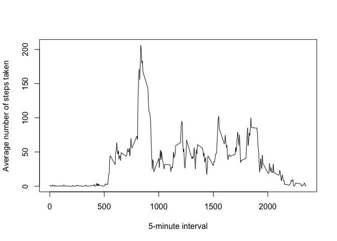

# Reproducible Research: Peer Assessment 1


## Loading and preprocessing the data


```r
unzip("activity.zip")
activity <- read.csv("activity.csv")
str(activity)
```

```
## 'data.frame':	17568 obs. of  3 variables:
##  $ steps   : int  NA NA NA NA NA NA NA NA NA NA ...
##  $ date    : Factor w/ 61 levels "2012-10-01","2012-10-02",..: 1 1 1 1 1 1 1 1 1 1 ...
##  $ interval: int  0 5 10 15 20 25 30 35 40 45 ...
```

```r
summary(activity)
```

```
##      steps                date          interval     
##  Min.   :  0.00   2012-10-01:  288   Min.   :   0.0  
##  1st Qu.:  0.00   2012-10-02:  288   1st Qu.: 588.8  
##  Median :  0.00   2012-10-03:  288   Median :1177.5  
##  Mean   : 37.38   2012-10-04:  288   Mean   :1177.5  
##  3rd Qu.: 12.00   2012-10-05:  288   3rd Qu.:1766.2  
##  Max.   :806.00   2012-10-06:  288   Max.   :2355.0  
##  NA's   :2304     (Other)   :15840
```

## What is mean total number of steps taken per day?

```r
library(ggplot2)
totalSteps <- tapply(activity$steps, activity$date, FUN=sum, na.rm=TRUE)
qplot(totalSteps, geom = "histogram", xlab = "Total number of steps taken per day")
```

```
## `stat_bin()` using `bins = 30`. Pick better value with `binwidth`.
```

<!-- -->

```r
mean(totalSteps, na.rm = TRUE)
```

```
## [1] 9354.23
```

```r
median(totalSteps, na.rm = TRUE)
```

```
## [1] 10395
```

## What is the average daily activity pattern?


```r
averages <- aggregate(x=list(steps=activity$steps), by=list(interval=activity$interval),
                      FUN=mean, na.rm=TRUE)
str(averages)
```

```
## 'data.frame':	288 obs. of  2 variables:
##  $ interval: int  0 5 10 15 20 25 30 35 40 45 ...
##  $ steps   : num  1.717 0.3396 0.1321 0.1509 0.0755 ...
```

```r
plot(averages$interval, averages$steps, type = "l", xlab = "5-minute interval",
     ylab = "Average number of steps taken")
```

<!-- -->

```r
averages <- data.frame(averages)
averages[which.max(averages$steps),]
```

```
##     interval    steps
## 104      835 206.1698
```


## Imputing missing values


### The strategy was fill the missing values by the average for each 5-minute interval


```r
missing <- is.na(activity$steps)
table(missing)
```

```
## missing
## FALSE  TRUE 
## 15264  2304
```

```r
fillMissing <- function(steps, interval){
    filled <- NA
    if(is.na(steps)){
        filled <- averages[averages$interval == interval, "steps"]
    }else{
        filled <- steps
    }
    return(filled)
}

fillActivity <- activity
fillActivity$steps <- mapply(fillMissing, fillActivity$steps, fillActivity$interval)

totalStepsFilled <- tapply(fillActivity$steps, fillActivity$date, FUN=sum, na.rm=TRUE)
qplot(totalStepsFilled, geom = "histogram", xlab = "Total number of steps taken per day")
```

```
## `stat_bin()` using `bins = 30`. Pick better value with `binwidth`.
```

<!-- -->

```r
## Show the mean and median
mean(totalStepsFilled, na.rm = TRUE)
```

```
## [1] 10766.19
```

```r
median(totalStepsFilled, na.rm = TRUE)
```

```
## [1] 10766.19
```

Mean and median are higher after fill the missing values with the mean of each interval, because there are some days with steps values NA for any interval.

## Are there differences in activity patterns between weekdays and weekends?


```r
fillActivity$date <- as.Date(fillActivity$date)
# create a vector of weekdays
weekdays1 <- c('Monday', 'Tuesday', 'Wednesday', 'Thursday', 'Friday')

fillActivity$wDay <- factor((weekdays(fillActivity$date) %in% weekdays1), 
         levels=c(FALSE, TRUE), labels=c('weekend', 'weekday'))

str(fillActivity)
```

```
## 'data.frame':	17568 obs. of  4 variables:
##  $ steps   : num  1.717 0.3396 0.1321 0.1509 0.0755 ...
##  $ date    : Date, format: "2012-10-01" "2012-10-01" ...
##  $ interval: int  0 5 10 15 20 25 30 35 40 45 ...
##  $ wDay    : Factor w/ 2 levels "weekend","weekday": 2 2 2 2 2 2 2 2 2 2 ...
```

```r
steps_by_interval <- aggregate(steps ~ interval + wDay, fillActivity, mean)

library(lattice)
xyplot(steps ~ interval | wDay, data = steps_by_interval, layout = c(1,2), type = "l",
       main="Average steps per day by interval")
```

<!-- -->


